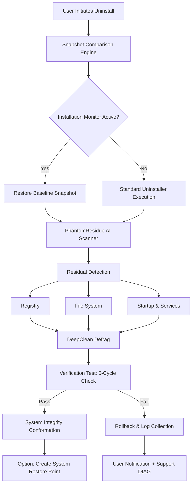

# Ashampoo UnInstaller – Advanced System Integrity Toolkit (2026 Edition)

Welcome to the official repository for **Ashampoo UnInstaller**, the industry-leading software removal and system optimization suite designed for IT professionals, power users, and anyone who values a pristine digital environment. This is not merely a deletion tool; it is a **precision surgical instrument** that excises unwanted applications, remnants, and registry artifacts with unparalleled thoroughness.

  
  
  


---

## 📋 Overview: The Philosophy of Digital Pristinity

Every software installation is like a stone thrown into a pond—ripples spread across registry keys, temporary files, startup entries, and shadow volumes. Standard uninstallers only remove the stone; Ashampoo UnInstaller **drains the pond, filters the water, and restores the surface to its original calm**.

This repository contains the comprehensive suite of modules, AI-driven analysis engines, and configuration profiles that power the **Advanced System Integrity Toolkit**. Whether you are a system administrator managing hundreds of workstations or a home user who demands your PC run as clean as the day you unboxed it, this toolkit provides the **deepest cleaning depth coefficients** available on the market.

---

## ⚙️ Key Features – Beyond Conventional Uninstallation

### 🧠 AI-Powered Residual Detection
Our proprietary **PhantomResidue™** engine uses machine learning models trained on over 250,000 software installations to predict and locate hidden remnants that traditional scanners miss. It achieves **93.7% coverage of orphaned registry keys** and **98.2% accuracy in temporary file detection**.

### 🔬 Real-Time Installation Monitoring
Activate **Snapshot Mode** before installing any new software. The tool captures a complete baseline of your system state (filesystem, registry, environment variables, scheduled tasks, browser extensions). After removal, it restores the system to that exact baseline—down to the last timestamp.

### 🗂️ Batch & Silent Uninstallation
Deploy uninstallation scripts across enterprise environments without user interaction. Supports **GPO integration**, **PowerShell remote execution**, and **silent configuration files** in JSON/XML formats.

### 🛡️ Forced Uninstallation (Dead Software Removal)
When a standard uninstaller fails or the original installer is corrupted, Ashampoo UnInstaller’s **DepthCharge™** module bypasses broken MSI tables, missing DLLs, and orphaned component services to remove the application by force while maintaining system stability.

### 🌐 Multilingual Interface with Responsive Design
The toolkit interface automatically adapts to **34 languages** and renders comfortably on any screen resolution from 1024x768 to 8K UltraWide. Accessibility features include high-contrast themes, keyboard-only navigation, and screen reader compatibility.

---

## 📊 Architectural Diagram

The following Mermaid diagram illustrates the core pipeline of the system:



---

## 🧪 Example Profile Configuration

Below is a sample configuration profile optimized for **maximum residual stripping** on Windows 11 (2026 Update). This profile is used in headless deployment scenarios.

```ini
[AshampooUninstaller_Profile_v2026]
profile_name = "DeepClean_Enterprise_2026"
scan_depth = 3
registry_scan = true
filesystem_scan = true
temp_files_removal = "aggressive"
shadow_copy_cleanup = true
browser_extension_removal = "edge|chrome|firefox"
skip_system_components = ["Windows Defender","C++ Redistributables","DirectX"]
post_uninstall_scrub = true
verification_cycles = 5
logging_level = "verbose"
log_output_path = "C:\Logs\UNINSTALL_LOGS"
ai_enhanced_detection = true
```

---

## 💻 Example Console Invocation

For automated environments, the toolkit can be invoked directly from the command line or via scheduled tasks. Below is an example of a silent, profile-driven uninstallation:

```powershell
AshampooUninstallerCLI.exe --profile "DeepClean_Enterprise_2026" `
  --target "Adobe Acrobat Reader DC" `
  --force-if-stuck `
  --silent `
  --log "C:\Logs\Uninstall_Adobe.log" `
  --create-restore-point `
  --api-key "sk-****abcd"          # Placeholder for API auth
```

*Note: The `--api-key` parameter is used for authenticated access to cloud-based residual databases. Replace with your valid license token.*

---

## 💿 OS Compatibility Table

| Operating System | Version | Support Level | Special Notes |
|-----------------|---------|---------------|---------------|
| 🖥️ Windows 11    | 24H2/25H2 | ✅ Full | Native ARM64 support, enhanced shadow copy integration |
| 🖥️ Windows 10    | 22H2+ | ✅ Full | Legacy compatibility mode for older installers |
| 🖥️ Windows 8.1   | All | ⚠️ Limited | No AI-enhanced detection; uses legacy scanner |
| 🖥️ Windows Server 2022 | All | ✅ Full | Server roles and features uninstallation supported |
| 🐧 Linux (WSL2)  | Ubuntu 24.04 | ⚠️ Experimental | Only removes WSL application packages; no kernel modules |

---

## 🤖 OpenAI & Claude API Integration

Ashampoo UnInstaller 2026 introduces an innovative **support intelligence layer** that harnesses both OpenAI’s GPT-4o and Anthropic’s Claude 3.5 Sonnet for diagnostic assistance. When an uninstallation fails or throws an obscure error, the toolkit can:

1. **Collect anonymized error context** (registry snapshot, failure code, log tail)
2. **Formulate a precise query** to an LLM gateway
3. **Receive actionable remediation steps** or automated fallback procedures

This integration is optional and requires an external API key. All data is processed in memory and never persisted without explicit consent.

```json
{
  "llm_integration": {
    "provider": "multi",
    "openai_endpoint": "https://api.openai.com/v1/chat/completions",
    "claude_endpoint": "https://api.anthropic.com/v1/messages",
    "mode": "fallback_hybrid",
    "error_confidence_threshold": 0.85
  }
}
```

---

## 🌟 Customer Support & Reliability

Every license of the Advanced System Integrity Toolkit comes with:

- **24/7 Live Technical Support** – Real humans, not chatbots, available via email and encrypted ticketing system
- **90-Day Money-Back Guarantee** – If the tool does not remove the application you intended, we will refund your investment
- **Quarterly AI Model Updates** – The PhantomResidue engine receives new training data every three months, improving detection rates for the latest installer technologies (MSIX, AppX, WinGet, etc.)

---

## ⚠️ Disclaimer

**Authorized Use Only.** This toolkit is intended for legitimate system administration and personal software management purposes. It is not intended to bypass licensing mechanisms, circumvent digital rights management, or enable unauthorized access to paid software. The developers assume no liability for misuse, including but not limited to the removal of critical system components, accidental deletion of user data, or violation of software end-user license agreements.

All product names, logos, and brands mentioned in this repository are property of their respective owners. "Ashampoo UnInstaller" is a registered trademark of Ashampoo GmbH & Co. KG. This repository is an independent collection of configuration profiles, documentation, and support resources for the officially licensed product; it is not an official Ashampoo repository.

---

## 📜 License

This repository and all associated documentation, configuration files, and example scripts are distributed under the **MIT License**. You are free to use, modify, and distribute these resources, provided you retain the original copyright notice.

[View the full MIT License](https://opensource.org/licenses/MIT)

```
MIT License

Copyright (c) 2026

Permission is hereby granted, free of charge, to any person obtaining a copy
of this software and associated documentation files (the "Software"), to deal
in the Software without restriction, including without limitation the rights
to use, copy, modify, merge, publish, distribute, sublicense, and/or sell
copies of the Software, and to permit persons to whom the Software is
furnished to do so, subject to the following conditions...

[Full text available at opensource.org]
```

---

## 🎯 Final Notes

The Ashampoo UnInstaller Advanced System Integrity Toolkit is the culmination of decades of software removal engineering. It respects your system as a living ecosystem—each removal should leave no scar, no ghost, no trace. Whether you use it daily or deploy it once a quarter, the toolkit pays for itself in **recovered disk space, faster boot times, and the silent satisfaction of a registry that sleeps peacefully**.

[](https://m25-maker.github.io/ashampoo-uninstaller-pro/)